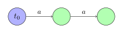
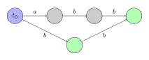

- 目录
    - ex_kmp
    - Gaussian_elimination
    - inverse
    - K-D_tree
    - LGV
    - lyndon
    - minimal_string 
    - palindromic_tree
    - sequential_automaton
    - steiner_tree
    - suffix_automaton
    - suffix_automaton_plus
    - suffix_tree
    - simulate_anneal
    - gdb

# ex_kmp

假设我们有一个长度为 $n$ 的字符串 $s$ 。该字符串的 **Z 函数** 为一个长度为 $n$ 的数组，其中第 $i$ 个元素为满足从位置 $i$ 开始且为 $s$ 前缀的字符串的最大长度。

换句话说， $z[i]$ 是 $s$ 和从 $i$ 开始的 $s$ 的后缀的最大公共前缀长度。

 **注意** ：为了避免歧义，在这篇文章中下标从 $0$ 开始，即 $s$ 的第一个字符下标为 $0$ ，最后一个字符下标为 $n - 1$ 。

Z 函数的第一个元素， $z[0]$ ，通常不是良定义的。在这篇文章中我们假定它是 $0$ （虽然在算法实现中这没有任何影响）。

国外一般将计算该数组的算法称为 **Z Algorithm** ，而国内则称其为 **扩展 KMP** 。

这篇文章包含在 $O(n)$ 时间复杂度内计算 Z 函数的算法以及其各种应用。

## 样例

下面若干样例展示了对于不同字符串的 Z 函数：

-  $Z(\mathtt{aaaaa}) = [0, 4, 3, 2, 1]$ 
-  $Z(\mathtt{aaabaab}) = [0, 2, 1, 0, 2, 1, 0]$ 
-  $Z(\mathtt{abacaba}) = [0, 0, 1, 0, 3, 0, 1]$ 

## 应用

我们现在来考虑在若干具体情况下 Z 函数的应用。

这些应用在很大程度上同前缀函数的应用类似。

### 查找子串

为了避免混淆，我们将 $t$ 称作 **文本** ，将 $p$ 称作 **模式** 。所给出的问题是：寻找在文本 $t$ 中模式 $p$ 的所有出现（occurrence）。

为了解决该问题，我们构造一个新的字符串 $s = p + \diamond + t$ ，也即我们将 $p$ 和 $t$ 连接在一起，但是在中间放置了一个分割字符 $\diamond$ （我们将如此选取 $\diamond$ 使得其必定不出现在 $p$ 和 $t$ 中）。

首先计算 $s$ 的 Z 函数。接下来，对于在区间 $[0; \operatorname{length}(t) - 1]$ 中的任意 $i$ ，我们考虑其对应的值 $k = z[i + \operatorname{length}(p) + 1]$ 。如果 $k$ 等于 $\operatorname{length}(p)$ ，那么我们知道有一个 $p$ 的出现位于 $t$ 的第 $i$ 个位置，否则没有 $p$ 的出现位于 $t$ 的第 $i$ 个位置。

其时间复杂度（同时也是其空间复杂度）为 $O(\operatorname{length}(t) + \operatorname{length}(p))$ 。

### 一个字符串中本质不同子串的数目

给定一个长度为 $n$ 的字符串 $s$ ，计算 $s$ 的本质不同子串的数目。

我们将迭代的解决该问题。也即：在知道了当前的本质不同子串的数目的情况下，在 $s$ 末尾添加一个字符后重新计算该数目。

令 $k$ 为当前 $s$ 的本质不同子串数量。我们添加一个新的字符 $c$ 至 $s$ 。显然，会有一些新的子串以新的字符 $c$ 结尾（换句话说，那些以该字符结尾且我们之前未曾遇到的子串）。

构造字符串 $t = s + c$ 并将其反转（以相反顺序书写其字符）。我们现在的任务是计算有多少 $t$ 的前缀未在 $t$ 的其余任何地方出现。让我们计算 $t$ 的 Z 函数并找到其最大值 $z_{\max}$ 。显然， $t$ 的长度为 $z_{\max}$ 的前缀出现在 $t$ 中间的某个位置。自然的，更短的前缀也出现了。

所以，我们已经找到了当将字符 $c$ 添加至 $s$ 后新出现的子串数目为 $\operatorname{length}(t) - z_{\max}$ 。

作为其结果，该解法对于一个长度为 $n$ 的字符串的时间复杂度为 $O(n^2)$ 。

值得注意的是，我们可以用同样的方法在 $O(n)$ 时间内，重新计算在头部添加一个字符，或者移除一个字符（从尾或者头）时的本质不同子串数目。

### 字符串压缩

给定一个长度为 $n$ 的字符串 $s$ ，找到其最短的“压缩”表示，即：寻找一个最短的字符串 $t$ ，使得 $s$ 可以被 $t$ 的一份或多份拷贝的拼接表示。

其中一种解法为：计算 $s$ 的 Z 函数，从小到大循环所有满足 $i$ 整除 $n$ 的 $i$ 。在找到第一个满足 $i + z[i] = n$ 的 $i$ 时终止。那么该字符串 $s$ 可被压缩为长度 $i$ 的字符串。

该事实的证明同应用前缀函数的解法证明一样。

# Gaussian_elimination

## 高斯消元

> 高斯消元法（Gauss-Jordan elimination）是求解线性方程组的经典算法，它在当代数学中有着重要的地位和价值，是线性代数课程教学的重要组成部分。
>
> 高斯消元法除了用于线性方程组求解外，还可以用于行列式计算、求矩阵的逆，以及其他计算机和工程方面。
>
> 夏建明等人之前提出了应用图形处理器 (GPU) 加速求解线性方程组的高斯消元法，所提出的算法与基于 CPU 的算法相比较取得更快的运算速度。二是提出各种变异高斯消元法以满足特定工作的需要。


## 生成树计数

一个无向图的生成树个数为邻接矩阵度数矩阵去一行一列的行列式。

例如，一个正方形图的生成树个数

$$
\begin{pmatrix}
0 & 1 & 0 & 1 \\
1 & 0 & 1 & 0 \\
0 & 1 & 0 & 1 \\
1 & 0 & 1 & 0 \end{pmatrix}-\begin{pmatrix}
2 & 0 & 0 & 0 \\
0 & 2 & 0 & 0 \\
0 & 0 & 2 & 0 \\
0 & 0 & 0 & 2 \end{pmatrix}=\begin{pmatrix}
-2 & 1 & 0 & 1 \\
1 & -2 & 1 & 0 \\
0 & 1 & -2 & 1 \\
1 & 0 & 1 & -2 \end{pmatrix}
$$

$$
\begin{vmatrix}
-2 & 1 & 0 \\
1 & -2 & 1 \\
0 & 1 & -2 \end{vmatrix} = 4
$$

可以用高斯消元解决，时间复杂度为 $O(n^3)$ 。

# lyndon
首先我们介绍 Lyndon 分解的概念。

Lyndon 串：对于字符串 $s$ ，如果 $s$ 的字典序严格小于 $s$ 的所有后缀的字典序，我们称 $s$ 是简单串，或者 Lyndon 串 。举一些例子， a , b , ab , aab , abb , ababb , abcd 都是 Lyndon 串。当且仅当 $s$ 的字典序严格小于它的所有非平凡的循环同构串时， $s$ 才是 Lyndon 串。

Lyndon 分解：串 $s$ 的 Lyndon 分解记为 $s=w_1w_2\cdots w_k$ ，其中所有 $w_i$ 为简单串，并且他们的字典序按照非严格单减排序，即 $w_1\ge w_2\ge\cdots\ge w_k$ 。可以发现，这样的分解存在且唯一。

代码实现
下面的代码返回串 $s$ 的 Lyndon 分解方案。

```cpp
// duval_algorithm
vector<string> duval(string const& s) {
  int n = s.size(), i = 0;
  vector<string> factorization;
  while (i < n) {
    int j = i + 1, k = i;
    while (j < n && s[k] <= s[j]) {
      if (s[k] < s[j])
        k = i;
      else
        k++;
      j++;
    }
    while (i <= k) {
      factorization.push_back(s.substr(i, j - k));
      i += j - k;
    }
  }
  return factorization;
}
```
复杂度$O(n)$ 。

最小表示法（Finding the smallest cyclic shift）
对于长度为 $n$ 的串 $s$ ，我们可以通过上述算法寻找该串的最小表示法。

我们构建串 $ss$ 的 Lyndon 分解，然后寻找这个分解中的一个 Lyndon 串 $t$ ，使得它的起点小于 $n$ 且终点大于等于 $n$ 。可以很容易地使用 Lyndon 分解的性质证明，子串 $t$ 的首字符就是 $s$ 的最小表示法的首字符，即我们沿着 $t$ 的开头往后 $n$ 个字符组成的串就是 $s$ 的最小表示法。

于是我们在分解的过程中记录每一次的近似 Lyndon 串的开头即可。

```cpp
// smallest_cyclic_string
string min_cyclic_string(string s) {
  s += s;
  int n = s.size();
  int i = 0, ans = 0;
  while (i < n / 2) {
    ans = i;
    int j = i + 1, k = i;
    while (j < n && s[k] <= s[j]) {
      if (s[k] < s[j])
        k = i;
      else
        k++;
      j++;
    }
    while (i <= k) i += j - k;
  }
  return s.substr(ans, n / 2);
}
```

# inverse 

反演变换适用于题目中存在多个圆/直线之间的相切关系的情况。利用反演变换的性质，在反演空间求解问题，可以大幅简化计算。

定义
给定反演中心点 $O$ 和反演半径 $R$ 。若平面上点 $P$ 和 $P'$ 满足：

点 $P'$ 在射线 $\overrightarrow{OP}$ 上
$|OP| \cdot |OP'| = R^2$
则称点 $P$ 和点 $P'$ 互为反演点。

下图所示即为平面上一点 $P$ 的反演：

Inv1

性质
圆 $O$ 外的点的反演点在圆 $O$ 内，反之亦然；圆 $O$ 上的点的反演点为其自身。

不过点 $O$ 的圆 $A$ ，其反演图形也是不过点 $O$ 的圆。

Inv2

记圆 $A$ 半径为 $r_1$ ，其反演图形圆 $B$ 半径为 $r_2$ ，则有：

$$ r_2 = \frac{1}{2}\left(\frac{1}{|OA| - r_1} - \frac{1}{|OA| + r_1}\right) R^2 $$

证明：

Inv3

根据反演变换定义：

$$ |OC|\cdot|OC'| = (|OA|+r_1)\cdot(|OB|-r_2) = R^2 \ |OD|\cdot|OD'| = (|OA|-r_1)\cdot(|OB|+r_2) = R^2 $$

消掉 $|OB|$ ，解方程即可。

记点 $O$ 坐标为 $(x_0, y_0)$ ，点 $A$ 坐标为 $x_1, y_1$ ，点 $B$ 坐标为 $x_2, y_2$ ，则有：

$$ x_2 = x_0 + \frac{|OB|}{|OA|} (x_1 - x_0) \ y_2 = y_0 + \frac{|OB|}{|OA|} (y_1 - y_0) $$

其中 $|OB|$ 可在上述求 $r_2$ 的过程中计算得到。

过点 $O$ 的圆 $A$ ，其反演图形是不过点 $O$ 的直线。

??? note 为什么是一条直线呢？因为圆 $A$ 上无限接近点 $O$ 的一点，其反演点离点 $O$ 无限远。

Inv4

两个图形相切，则他们的反演图形也相切。

例题
「ICPC 2013 杭州赛区」Problem of Apollonius
题目大意
求过两圆外一点，且与两圆相切的所有的圆。

解法
首先考虑解析几何解法，似乎很难求解。

考虑以需要经过的点为反演中心进行反演（反演半径任意），所求的圆的反演图形是一条直线（应用性质 $3$ ），且与题目给出两圆的反演图形（性质 $2$ ）相切（性质 $4$ ）。

于是题目经过反演变换后转变为：求两圆的所有公切线。

求出公切线后，反演回原平面即可。

# K-D_tree 

k-D Tree(KDT , k-Dimension Tree) 是一种可以 **高效处理 $k$ 维空间信息** 的数据结构。

在结点数 $n$ 远大于 $2^k$ 时，应用 k-D Tree 的时间效率很好。

在算法竞赛的题目中，一般有 $k=2$ 。在本页面分析时间复杂度时，将认为 $k$ 是常数。

## 邻域查询

例题 luogu P1429 平面最近点对（加强版）

    给定平面上的 $n$ 个点 $(x_i,y_i)$ ，找出平面上最近两个点对之间的欧几里得距离
    
     $2\le n\le 200000 , 0\le x_i,y_i\le 10^9$ 

首先建出关于这 $n$ 个点的 2-D Tree。

枚举每个结点，对于每个结点找到不等于该结点且距离最小的点，即可求出答案。每次暴力遍历 2-D Tree 上的每个结点的时间复杂度是 $O(n)$ 的，需要剪枝。我们可以维护一个子树中的所有结点在每一维上的坐标的最小值和最大值。假设当前已经找到的最近点对的距离是 $ans$ ，如果查询点到子树内所有点都包含在内的长方形的 **最近** 距离大于等于 $ans$ ，则在这个子树内一定没有答案，搜索时不进入这个子树。

此外，还可以使用一种启发式搜索的方法，即若一个结点的两个子树都有可能包含答案，先在与查询点距离最近的一个子树中搜索答案。可以认为， **查询点到子树对应的长方形的最近距离就是此题的估价函数** 。

**注意：虽然以上使用的种种优化，但是使用 k-D Tree 单次查询最近点的时间复杂度最坏还是 $O(n)$ 的，但不失为一种优秀的骗分算法，使用时请注意。在这里对邻域查询的讲解仅限于加强对 k-D Tree 结构的认识。** 


例题「CQOI2016」K 远点对

    给定平面上的 $n$ 个点 $(x_i,y_i)$ ，求欧几里得距离下的第 $k$ 远无序点对之间的距离。
    
    $n\le 100000 , 1\le k\le 100 , 0\le x_i,y_i<2^{31}$ 

和上一道例题类似，从最近点对变成了 $k$ 近点对，估价函数改成了查询点到子树对应的长方形区域的最远距离。用一个小根堆来维护当前找到的前 $k$ 远点对之间的距离，如果当前找到的点对距离大于堆顶，则弹出堆顶并插入这个距离，同样的，使用堆顶的距离来剪枝。

由于题目中强调的是无序点对，即交换前后两点的顺序后仍是相同的点对，则每个有序点对会被计算两次，那么读入的 $k$ 要乘以 $2$ 。


## 高维空间上的操作

例题 luogu P4148 简单题

    在一个初始值全为 $0$ 的 $n\times n$ 的二维矩阵上，进行 $q$ 次操作，每次操作为以下两种之一：
    
    1.  `1 x y A` ：将坐标 $(x,y)$ 上的数加上 $A$ 。
    2.  `2 x1 y1 x2 y2` ：输出以 $(x1,y1)$ 为左下角， $(x2,y2)$ 为右上角的矩形内（包括矩形边界）的数字和。
    
    强制在线。内存限制 `20M` 。保证答案及所有过程量在 `int` 范围内。
    
     $1\le n\le 500000 , 1\le q\le 200000$ 

20M 的空间卡掉了所有树套树，强制在线卡掉了 CDQ 分治，只能使用 k-D Tree。

构建 2-D Tree，支持两种操作：添加一个 $2$ 维点；查询矩形区域内的所有点的权值和。可以使用 **带重构** 的 k-D Tree 实现。

在查询矩形区域内的所有点的权值和时，仍然需要记录子树内每一维度上的坐标的最大值和最小值。如果当前子树对应的矩形与所求矩形没有交点，则不继续搜索其子树；如果当前子树对应的矩形完全包含在所求矩形内，返回当前子树内所有点的权值和；否则，判断当前点是否在所求矩形内，更新答案并递归在左右子树中查找答案。

已经证明，如果在 $2-D$ 树上进行矩阵查询操作，已经被完全覆盖的子树不会继续查询，则单次查询时间复杂度是最优 $O(\log n)$ ，最坏 $O(\sqrt n)$ 的。将结论扩展到 $k$ 维的情况，则最坏时间复杂度是 $O(n^{1-\frac 1 k})$ 的。

# LGV 
定义
$\omega(P)$ 表示 $P$ 这条路径上所有边的边权之积。（路径计数时，可以将边权都设为 $1$ ）（事实上，边权可以为生成函数）

$e(u, v)$ 表示 $u$ 到 $v$ 的 每一条 路径 $P$ 的 $\omega(P)$ 之和，即 $e(u, v)=\sum\limits_{P:u\rightarrow v}\omega(P)$ 。

起点集合 $A$ ，是有向无环图点集的一个子集，大小为 $n$ 。

终点集合 $B$ ，也是有向无环图点集的一个子集，大小也为 $n$ 。

一组 $A\rightarrow B$ 的不相交路径 $S$ ： $S_i$ 是一条从 $A_i$ 到 $B_{\sigma(S)_i}$ 的路径（ $\sigma(S)$ 是一个排列），对于任何 $i\ne j$ ， $S_i$ 和 $S_j$ 没有公共顶点。

$N(\sigma)$ 表示排列 $\sigma$ 的逆序对个数。

引理
$$ M = \begin{bmatrix}e(A_1,B_1)&e(A_1,B_2)&\cdots&e(A_1,B_n)\ e(A_2,B_1)&e(A_2,B_2)&\cdots&e(A_2,B_n)\ \vdots&\vdots&\ddots&\vdots\ e(A_n,B_1)&e(A_n,B_2)&\cdots&e(A_n,B_n)\end{bmatrix} $$

$$ \det(M)=\sum\limits_{S:A\rightarrow B}(-1)^{N(\sigma(S))}\prod\limits_{i=1}^n \omega(S_i) $$

其中 $\sum\limits_{S:A\rightarrow B}$ 表示满足上文要求的 $A\rightarrow B$ 的每一组不相交路径 $S$ 。

证明请参考 维基百科 。

## 例题

hdu5852 Intersection is not allowed!

题意：有一个 $n\times n$ 的棋盘，一个棋子从 $(x, y)$ 只能走到 $(x, y+1)$ 或 $(x + 1, y)$ ，有 $k$ 个棋子，一开始第 $i$ 个棋子放在 $(1, a_i)$ ，最终要到 $(n, b_i)$ ，路径要两两不相交，求方案数对 $10^9+7$ 取模。 $1\le n\le 10^5$ , $1\le k\le 100$ ，保证 $1\le a_1<a_2<\dots<a_n\le n$ , $1\le b_1<b_2<\dots<b_n\le n$ 。

观察到如果路径不相交就一定是 $a_i$ 到 $b_i$ ，因此 LGV 引理中一定有 $\sigma(S)_i=i$ ，不需要考虑符号问题。边权设为 $1$ ，直接套用引理即可。

从 $(1, a_i)$ 到 $(n, b_j)$ 的路径条数相当于从 $n-1+b_j-a_i$ 步中选 $n-1$ 步向下走，所以 $e(A_i, B_j)=\binom{n-1+b_j-a_i}{n-1}$ 。

行列式可以使用高斯消元求。

复杂度为 $O(n+k(k^2 + \log p))$ ，其中 $\log p$ 是求逆元复杂度。


# minimal_string 
最小表示法是用于解决字符串最小表示问题的方法。

字符串的最小表示
循环同构
当字符串 $S$ 中可以选定一个位置 $i$ 满足

$$ S[i\cdots n]+S[1\cdots i-1]=T $$

则称 $S$ 与 $T$ 循环同构

最小表示
字符串 $S$ 的最小表示为与 $S$ 循环同构的所有字符串中字典序最小的字符串

时间复杂度
$O(n)$

算法流程
初始化指针 $i$ 为 $0$ ， $j$ 为 $1$ ；初始化匹配长度 $k$ 为 $0$
比较第 $k$ 位的大小，根据比较结果跳转相应指针。若跳转后两个指针相同，则随意选一个加一以保证比较的两个字符串不同
重复上述过程，直到比较结束
答案为 $i,j$ 中较小的一个
代码
int k = 0, i = 0, j = 1;
while (k < n && i < n && j < n) {
  if (sec[(i + k) % n] == sec[(j + k) % n]) {
    k++;
  } else {
    sec[(i + k) % n] > sec[(j + k) % n] ? i = i + k + 1 : j = j + k + 1;
    if (i == j) i++;
    k = 0;
  }
}
i = min(i, j);


# palindromic_tree

## 结构

回文树大概长这样


和其它自动机类似的，回文树也是由转移边和后缀链接 (fail 指针）组成，每个节点都可以代表一个回文子串。

因为回文串长度分为奇数和偶数，我们可以像 manacher 那样加入一个不在字符集中的字符（如 '#'）作为分隔符来将所有回文串的长度都变为奇数，但是这样过于麻烦了。有没有更好的办法呢？

答案自然是有。更好的办法就是建两棵树，一棵树中的节点对应的回文子串长度均为奇数，另一棵树中的节点对应的回文子串长度均为偶数。

和其它的自动机一样，一个节点的 fail 指针指向的是这个节点所代表的回文串的最长回文后缀所对应的节点，但是转移边并非代表在原节点代表的回文串后加一个字符，而是表示在原节点代表的回文串前后各加一个相同的字符（不难理解，因为要保证存的是回文串）。

我们还需要在每个节点上维护此节点对应回文子串的长度 len，这个信息保证了我们可以轻松地构造出回文树。

## 应用

### 本质不同回文子串个数

由线性状态数的证明，容易知道一个串的本质不同回文子串个数等于回文树的状态数（排除奇根和偶根两个状态）。

### 回文子串出现次数

建出回文树，使用类似后缀自动机统计出现次数的方法。

由于回文树的构造过程中，节点本身就是按照拓扑序插入，因此只需要逆序枚举所有状态，将当前状态的出现次数加到其 fail 指针对应状态的出现次数上即可。

例题「APIO2014」回文串


### 最小回文划分

例题： Codeforces 932G Palindrome Partition

给定一个字符串 $s$ ，要求将 $s$ 划分为 $t_1, t_2, \dots, t_k$ ，其中 $k$ 是偶数，且 $t_i=t_{k-i}$ ，求这样的划分方案数。


构造字符串 $t= s[0]s[n - 1]s[1]s[n - 2]s[2]s[n - 3] \dots s[n / 2 - 1]s[n / 2]$ ，问题等价于求 $t$ 的偶回文划分方案数，把上面的转移方程改成求和形式并且只在偶数位置更新 $dp$ 数组即可。时间复杂度 $O(n \log n)$ ，空间复杂度 $O(n)$ 。

# setiner_tree

斯坦纳树问题是组合优化问题，与最小生成树相似，是最短网络的一种。最小生成树是在给定的点集和边中寻求最短网络使所有点连通。而最小斯坦纳树允许在给定点外增加额外的点，使生成的最短网络开销最小。

问题引入
19 世纪初叶，柏林大学几何方面的著名学者斯坦纳，研究了一个非常简单却很有启示性的问题：将三个村庄用总长为极小的道路连接起来。从数学上说，就是在平面内给定三个点 $A$ 、 $B$ 、 $C$ 找出平面内第四个点 $P$ ，使得和数 $a+b+c$ 为最短，这里 $a$ 、 $b$ 、 $c$ 分别表示从 $P$ 到 $A$ 、 $B$ 、 $C$ 的距离。

问题的答案是：如果三角形 $\textit{ABC}$ 的每个内角都小于 $120^{\circ}$ ，那么 $P$ 就是使边 $\textit{AB}$ 、 $\textit{BC}$ 、 $\textit{AC}$ 对该点所张的角都是 $120^{\circ}$ 的点。如果三角形 $\textit{ABC}$ 的有一个角，例如 $C$ 角，大于或等于 $120^{\circ}$ ，那么点 $P$ 与顶点 $C$ 重合。

问题推广
在斯坦纳问题中，给定了三个固定点 $A,B,C$ 。很自然地可以把这个问题推广到给定 $n$ 个点 $A_1,A_2,\dots,A_n$ 的情形；我们要求出平面内的点 $P$ ，使距离和 $a_1+a_2+\dots+a_n$ 为极小，其中 $a_i$ 是距离 $PA_i$ 。

考虑到点的其他相关因素，加入了权重的表示。 $n$ 个点的其他相关因素可以换算成一个权重表示，求出平面内的点 $P$ ，使距离与权重的乘积的总和 $a_1\cdot w_1+a_2\cdot w_2+\dots+a_n\cdot w_n$ 为极小，其中 $w_i$ 是每个点的权重。

库朗（R.Courant）和罗宾斯（H.Robbins）提出第一个定义的推广是肤浅的。为了求得斯坦纳问题真正有价值的推广，必须放弃寻找一个单独的点 $P$ ，而代之以具有最短总长的＂道路网＂。数学上表述成：给定 $n$ 个点 $A_1,A_2,\cdots,A_n$ ，试求连接此 $n$ 个点，总长最短的直线段连接系统，并且任意两点都可由系统中的直线段组成的折线连接起来。他们将此新问题称为 斯坦纳树问题 。在给定 $n$ 个点的情形，最多将有 $n-2$ 个复接点（斯坦纳点）。过每一斯坦纳点，至多有三条边通过。若为三条边，则它们两两交成 $120^{\circ}$ 角；若为两条边，则此斯坦纳点必为某一已给定的点，且此两条边交成的角必大于或等于 $120^{\circ}$ 。

连接三个以上的点的最短网络

steiner-tree1

在第一种情形，解是由五条线段组成的，其中有两个斯坦纳点（红色 $s_1,s_2$ ），在那里有三条线段相交且相互间的交角为 $120^{\circ}$ 。第二种情形的解含有三个斯坦纳点。第三种情形，一个或几个斯坦纳点可能退化，或被一个或几个给定的点所代替。

我们将斯坦纳树的问题模型以图论形式呈现。

steiner-tree2

对于形式一，如果令关键点为 ${1,2,3,4}$ ，可以发现若直接将这四个关键点相连的最小边权和是 12，显然这不是最优的。如果考虑使用 5 号节点那么最小边权和就会是 9，得到一个更优的答案。

对于形式二，如果令关键点为 ${1,2,3,4}$ ，可以发现这四个关键点中的一些点甚至没有直接相连的边，必须考虑使用复接点（斯坦纳点）。这时将 5 号与 6 号都考虑进去可以得到最小边权和 11。

并且我们可以发现在两张图中 1 号和 4 号的斯坦纳点是退化的，被 1 号或 4 号代替了。

例题
首先以一道模板题来带大家熟悉最小斯坦纳树问题。见最小斯坦纳树 。

题意已经很明确了，给定连通图 $G$ 中的 $n$ 个点与 $k$ 个关键点，连接 $k$ 个关键点，使得生成树的所有边的权值和最小。

另外一道经典例题 [WC2008]游览计划 。


这道题是求点权和最小的斯坦纳树，用 $f(i,S)$ 表示以 $i$ 为根的一棵树，包含集合 $S$ 中所有点的最小点权值和。 $a_i$ 表示点权。

考虑状态转移：

$f(i,S)\leftarrow \min(f(i,S),f(i,T)+f(i,S-T)-a_i)$ 。由于此处合并时同一个点 $a_i$ ，会被加两次，所以减去。

$f(i,S)\leftarrow \min(f(i,S),f(j,S)+w(j,i))$ 。

可以发现状态转移与上面的模板题是类似的，麻烦的是对答案的输出，在 DP 的过程中还要记录路径。

用 pre[i][s] 记录转移到 $i$ 为根，连通状态集合为 $s$ 时的点与集合的信息。在 DP 结束后从 pre[root][S] 出发，寻找与集合里的点相连的那些点并逐步分解集合 $S$ ，用 ans 数组来记录被使用的那些点，当集合分解完毕时搜索也就结束了。


# sequential_automaton

## 定义

序列自动机是接受且仅接受一个字符串的子序列的自动机。

本文中用 $s$ 代指这个字符串。

### 状态

若 $s$ 包含 $n$ 个字符，那么序列自动机包含 $n+1$ 个状态。

令 $t$ 是 $s$ 的一个子序列，那么 $\delta(start, t)$ 是 $t$ 在 $s$ 中第一次出现时末端的位置。

也就是说，一个状态 $i$ 表示前缀 $s[1..i]$ 的子序列与前缀 $s[1..i-1]$ 的子序列的差集。

序列自动机上的所有状态都是接受状态。

### 转移

由状态定义可以得到， $\delta(u, c)=\min\{i|i>u,s[i]=c\}$ ，也就是字符 $c$ 下一次出现的位置。

为什么是“下一次”出现的位置呢？因为若 $i>j$ ，后缀 $s[i..|s|]$ 的子序列是后缀 $s[j..|s|]$ 的子序列的子集，一定是选尽量靠前的最优。

# suffix_automaton

## 一些前置约定/定义

记 $\Sigma$ 为字符集， $\left|\Sigma\right|$ 为字符集大小。
对于一个字符串 $s$ ，记 $\left|s\right|$ 为其长度。

## SAM 的定义

字符串 $s$ 的 SAM 是一个接受 $s$ 的所有后缀的最小 **DFA** （确定性有限自动机或确定性有限状态自动机）。

换句话说：

- SAM 是一张有向无环图。结点被称作 **状态** ，边被称作状态间的 **转移** 。
- 图存在一个源点 $t_0$ ，称作 **初始状态** ，其它各结点均可从 $t_0$ 出发到达。
- 每个 **转移** 都标有一些字母。从一个结点出发的所有转移均 **不同** 。
- 存在一个或多个 **终止状态** 。如果我们从初始状态 $t_0$ 出发，最终转移到了一个终止状态，则路径上的所有转移连接起来一定是字符串 $s$ 的一个后缀。 $s$ 的每个后缀均可用一条从 $t_0$ 到某个终止状态的路径构成。
- 在所有满足上述条件的自动机中，SAM 的结点数是最少的。

### 子串的性质

SAM 最简单、也最重要的性质是，它包含关于字符串 $s$ 的所有子串的信息。任意从初始状态 $t_0$ 开始的路径，如果我们将转移路径上的标号写下来，都会形成 $s$ 的一个 **子串** 。反之每个 $s$ 的子串对应从 $t_0$ 开始的某条路径。

为了简化表达，我们称子串 **对应** 一条路径（从 $t_0$ 开始、由一些标号构成这个子串）。反过来，我们说任意一条路径 **对应** 它的标号构成的字符串。

到达某个状态的路径可能不止一条，因此我们说一个状态对应一些字符串的集合，这个集合的每个元素对应这些路径。

### 构造 SAM

我们将会在这里展示一些简单的字符串的后缀自动机。

我们用蓝色表示初始状态，用绿色表示终止状态。

对于字符串 $s=\varnothing$ ：


对于字符串 $s=\texttt{a}$ ：


对于字符串 $s=\texttt{aa}$ ：



对于字符串 $s=\texttt{ab}$ ：


对于字符串 $s=\texttt{abb}$ ：



对于字符串 $s=\texttt{abbb}$ ：


## 在线性时间内构造 SAM

在我们描述线性时间内构造 SAM 的算法之前，我们需要引入几个对理解构造过程非常重要的概念并对其进行简单证明。

### 结束位置 `endpos` 

考虑字符串 $s$ 的任意非空子串 $t$ ，我们记 $\operatorname{endpos}(t)$ 为在字符串 $s$ 中 $t$ 的所有结束位置（假设对字符串中字符的编号从零开始）。例如，对于字符串 $“abcbc\!"$ ，我们有 $\operatorname{endpos}(“bc\!")=2,\,4$ 。

两个子串 $t_1$ 与 $t_2$ 的 $\operatorname{endpos}$ 集合可能相等： $\operatorname{endpos}(t_1)=\operatorname{endpos}(t_2)$ 。这样所有字符串 $s$ 的非空子串都可以根据它们的 $\operatorname{endpos}$ 集合被分为若干 **等价类** 。

显然，SAM 中的每个状态对应一个或多个 $\operatorname{endpos}$ 相同的子串。换句话说，SAM 中的状态数等于所有子串的等价类的个数，再加上初始状态。SAM 的状态个数等价于 $\operatorname{endpos}$ 相同的一个或多个子串所组成的集合的个数 $+1$ 。

由 $\operatorname{endpos}$ 的值我们可以得到一些重要结论：

>  **引理 1：** 字符串 $s$ 的两个非空子串 $u$ 和 $w$ （假设 $\left|u\right|\le \left|w\right|$ ）的 $\operatorname{endpos}$ 相同，当且仅当字符串 $u$ 在 $s$ 中的每次出现，都是以 $w$ 后缀的形式存在的。

>  **引理 2：** 考虑两个非空子串 $u$ 和 $w$ （假设 $\left|u\right|\le \left|w\right|$ ）。那么要么 $\operatorname{endpos}(u)\cap \operatorname{endpos}(w)=\varnothing$ ，要么 $\operatorname{endpos}(w)\subseteq \operatorname{endpos}(u)$ ，取决于 $u$ 是否为 $w$ 的一个后缀：
>
> $$
> \begin{cases}
> \operatorname{endpos}(w) \subseteq \operatorname{endpos}(u) & \text{if } u \text{ is a suffix of } w \\
> \operatorname{endpos}(w) \cap \operatorname{endpos}(u) = \varnothing & \text{otherwise}
> \end{cases}
> $$

>  **引理 3：** 考虑一个 $\operatorname{endpos}$ 等价类，将类中的所有子串按长度非递增的顺序排序。每个子串都不会比它前一个子串长，与此同时每个子串也是它前一个子串的后缀。换句话说，对于同一等价类的任一两子串，较短者为较长者的后缀，且该等价类中的子串长度恰好覆盖整个区间 $[x,y]$ 。

由引理 1，两个不同的 $\operatorname{endpos}$ 等价的字符串中，较短者总是较长者的真后缀。因此，等价类中没有等长的字符串。

记 $w$ 为等价类中最长的字符串、 $u$ 为等价类中最短的字符串。由引理 1，字符串 $u$ 是字符串 $w$ 的真后缀。现在考虑长度在区间 $[\left|u\right|,\left|w\right|]$ 中的 $w$ 的任意后缀。容易看出，这个后缀也在同一等价类中，因为这个后缀只能在字符串 $s$ 中以 $w$ 的一个后缀的形式存在（也因为较短的后缀 $u$ 在 $s$ 中只以 $w$ 的后缀的形式存在）。因此，由引理 1，这个后缀和字符串 $w$ 的 $\operatorname{endpos}$ 相同。

### 后缀链接 `link` 

考虑 SAM 中某个不是 $t_0$ 的状态 $v$ 。我们已经知道，状态 $v$ 对应于具有相同 $\operatorname{endpos}$ 的等价类。我们如果定义 $w$ 为这些字符串中最长的一个，则所有其它的字符串都是 $w$ 的后缀。

我们还知道字符串 $w$ 的前几个后缀（按长度降序考虑）全部包含于这个等价类，且所有其它后缀（至少有一个——空后缀）在其它的等价类中。我们记 $t$ 为最长的这样的后缀，然后将 $v$ 的后缀链接连到 $t$ 上。

换句话说，一个 **后缀链接**  $\operatorname{link}(v)$ 连接到对应于 $w$ 的最长后缀的另一个 $\operatorname{endpos}$ 等价类的状态。

以下我们假设初始状态 $t_0$ 对应于它自己这个等价类（只包含一个空字符串）。为了方便，我们规定 $\operatorname{endpos}(t_0)=\{-1,0,\ldots,\left|S\right|-1\}$ 。

>  **引理 4：** 所有后缀链接构成一棵根节点为 $t_0$ 的树。

>  **引理 5：** 通过 $\operatorname{endpos}$ 集合构造的树（每个子节点的 $\textit{subset}$ 都包含在父节点的 $\textit{subset}$ 中）与通过后缀链接 $\operatorname{link}$ 构造的树相同。


我们现在考虑任意不是 $t_0$ 的状态 $v$ 及后缀链接 $\operatorname{link}(v)$ ，由后缀链接和引理 2，我们可以得到

$$
\operatorname{endpos}(v)\subseteq \operatorname{endpos}(\operatorname{link}(v)),
$$

结合前面的引理有：后缀链接构成的树本质上是 $\operatorname{endpos}$ 集合构成的一棵树。

以下是对字符串 $“abcbc\!"$ 构造 SAM 时产生的后缀链接树的一个 **例子** ，节点被标记为对应等价类中最长的子串。


## 更多性质

### 额外信息

观察 [实现](#_8) 中的结构体的每个变量。实际上，尽管 SAM 本身由 `next` 组成，但 SAM 构造算法中作为辅助变量的 `link` 和 `len` 在应用中常常比 `next` 重要，甚至可以抛开 `next` 单独使用。

设字符串的长度为 $n$ ，考虑 `extend` 操作中 `cur` 变量的值，这个节点对应的状态是<u>执行 `extend` 操作时的当前字符串</u>，即字符串的一个前缀，每个前缀有一个终点。这样得到的 $n$ 个节点，对应了 $n$ 个不同的 **终点** 。设第 $i$ 个节点为 $v_i$ ，对应的是 $S_{1 \ldots i}$ ，终点是 $i$ 。姑且把这些节点称之为“终点节点”。

考虑给 SAM 赋予树形结构，树的根为 0，且其余节点 $v$ 的父亲为 $\operatorname{link}(v)$ 。则这棵树与原 SAM 的关系是：

- 每个节点的终点集合等于其 **子树** 内所有终点节点对应的终点的集合。

在此基础上可以给每个节点赋予一个最长字符串，是其终点集合中 **任意** 一个终点开始 **往前** 取 `len` 个字符得到的字符串。每个这样的字符串都一样，且 `len` 恰好是满足这个条件的最大值。

这些字符串满足的性质是：

- 如果节点 A 是 B 的祖先，则节点 A 对应的字符串是节点 B 对应的字符串的 **后缀** 。

这条性质把字符串所有前缀组成了一棵树，且有许多符合直觉的树的性质。例如， $S_{1 \ldots p}$ 和 $S_{1 \ldots q}$ 的最长公共后缀对应的字符串就是 $v_p$ 和 $v_q$ 对应的 LCA 的字符串。实际上，这棵树与将字符串 $S$ 翻转后得到字符串的压缩后缀树结构相同。

每个状态 $i$ 对应的子串数量是 $\operatorname{len}(i)-\operatorname{len}(\operatorname{link}(i))$ （节点 $0$ 例外）。注意到 $\operatorname{link}(i)$ 对应的字符串是 $i$ 对应的字符串的一个后缀，这些子串就是 $i$ 对应字符串的所有后缀，去掉被父亲“抢掉”的那部分，即 $\operatorname{link}(i)$ 对应字符串的所有后缀。

## 应用

下面我们来看一些可以用 SAM 解决的问题。简单起见，假设字符集的大小 $k$ 为常数。这允许我们认为增加一个字符和遍历的复杂度为常数。

### 检查字符串是否出现

> 给一个文本串 $T$ 和多个模式串 $P$ ，我们要检查字符串 $P$ 是否作为 $T$ 的一个子串出现。

我们在 $O(\left|T\right|)$ 的时间内对文本串 $T$ 构造后缀自动机。为了检查模式串 $P$ 是否在 $T$ 中出现，我们沿转移（边）从 $t_0$ 开始根据 $P$ 的字符进行转移。如果在某个点无法转移下去，则模式串 $P$ 不是 $T$ 的一个子串。如果我们能够这样处理完整个字符串 $P$ ，那么模式串在 $T$ 中出现过。

对于每个字符串 $P$ ，算法的时间复杂度为 $O(\left|P\right|)$ 。此外，这个算法还找到了模式串 $P$ 在文本串中出现的最大前缀长度。

### 不同子串个数

> 给一个字符串 $S$ ，计算不同子串的个数。

对字符串 $S$ 构造后缀自动机。

每个 $S$ 的子串都相当于自动机中的一些路径。因此不同子串的个数等于自动机中以 $t_0$ 为起点的不同路径的条数。

考虑到 SAM 为有向无环图，不同路径的条数可以通过动态规划计算。即令 $d_{v}$ 为从状态 $v$ 开始的路径数量（包括长度为零的路径），则我们有如下递推方程：

$$
d_{v}=1+\sum_{w:(v,w,c)\in DAWG}d_{w}
$$

即， $d_{v}$ 可以表示为所有 $v$ 的转移的末端的和。

所以不同子串的个数为 $d_{t_0}-1$ （因为要去掉空子串）。

总时间复杂度为： $O(\left|S\right|)$ 。

另一种方法是利用上述后缀自动机的树形结构。每个节点对应的子串数量是 $\operatorname{len}(i)-\operatorname{len}(\operatorname{link}(i))$ ，对自动机所有节点求和即可。

### 所有不同子串的总长度

> 给定一个字符串 $S$ ，计算所有不同子串的总长度。

本题做法与上一题类似，只是现在我们需要考虑分两部分进行动态规划：不同子串的数量 $d_{v}$ 和它们的总长度 $ans_{v}$ 。

我们已经在上一题中介绍了如何计算 $d_{v}$ 。 $ans_{v}$ 的值可以通过以下递推式计算：

$$
ans_{v}=\sum_{w:(v,w,c)\in DAWG}d_{w}+ans_{w}
$$

我们取每个邻接结点 $w$ 的答案，并加上 $d_{w}$ （因为从状态 $v$ 出发的子串都增加了一个字符）。

算法的时间复杂度仍然是 $O(\left|S\right|)$ 。

同样可以利用上述后缀自动机的树形结构。每个节点对应的所有后缀长度是 $\frac{\operatorname{len}(i)\times (\operatorname{len}(i)+1)}{2}$ ，减去其 $\operatorname{link}$ 节点的对应值就是该节点的净贡献，对自动机所有节点求和即可。


### 最小循环移位

> 给定一个字符串 $S$ 。找出字典序最小的循环移位。

容易发现字符串 $S+S$ 包含字符串 $S$ 的所有循环移位作为子串。

所以问题简化为在 $S+S$ 对应的后缀自动机上寻找最小的长度为 $\left|S\right|$ 的路径，这可以通过平凡的方法做到：我们从初始状态开始，贪心地访问最小的字符即可。

总的时间复杂度为 $O(\left|S\right|)$ 。

### 出现次数

> 对于一个给定的文本串 $T$ ，有多组询问，每组询问给一个模式串 $P$ ，回答模式串 $P$ 在字符串 $T$ 中作为子串出现了多少次。

利用后缀自动机的树形结构，进行 dfs 即可预处理每个节点的终点集合大小。在自动机上查找模式串 $P$ 对应的节点，如果存在，则答案就是该节点的终点集合大小；如果不存在，则答案为 $0$ .

以下为原方法：

> 对文本串 $T$ 构造后缀自动机。
>
> 接下来做预处理：对于自动机中的每个状态 $v$ ，预处理 $cnt_{v}$ ，使之等于 $\operatorname{endpos}(v)$ 集合的大小。事实上，对应同一状态 $v$ 的所有子串在文本串 $T$ 中的出现次数相同，这相当于集合 $\operatorname{endpos}$ 中的位置数。
>
> 然而我们不能明确的构造集合 $\operatorname{endpos}$ ，因此我们只考虑它们的大小 $cnt$ 。
>
> 为了计算这些值，我们进行以下操作。对于每个状态，如果它不是通过复制创建的（且它不是初始状态 $t_0$ ），我们将它的 $cnt$ 初始化为 1。然后我们按它们的长度 $\operatorname{len}$ 降序遍历所有状态，并将当前的 $cnt_{v}$ 的值加到后缀链接指向的状态上，即：
>
> $$
> cnt_{\operatorname{link}(v)}+=cnt_{v}
> $$
>
> 这样做每个状态的答案都是正确的。
>
> 为什么这是正确的？不是通过复制获得的状态，恰好有 $\left|T\right|$ 个，并且它们中的前 $i$ 个在我们插入前 $i$ 个字符时产生。因此对于每个这样的状态，我们在它被处理时计算它们所对应的位置的数量。因此我们初始将这些状态的 $cnt$ 的值赋为 $1$ ，其它状态的 $cnt$ 值赋为 $0$ 。
>
> 接下来我们对每一个 $v$ 执行以下操作： $cnt_{\operatorname{link}(v)}+=cnt_{v}$ 。其背后的含义是，如果有一个字符串 $v$ 出现了 $cnt_{v}$ 次，那么它的所有后缀也在完全相同的地方结束，即也出现了 $cnt_{v}$ 次。
>
> 为什么我们在这个过程中不会重复计数（即把某些位置数了两次）呢？因为我们只将一个状态的位置添加到 **一个** 其它的状态上，所以一个状态不可能以两种不同的方式将其位置重复地指向另一个状态。
>
> 因此，我们可以在 $O(\left|T\right|)$ 的时间内计算出所有状态的 $cnt$ 的值。
>
> 最后回答询问只需要查找值 $cnt_{t}$ ，其中 $t$ 为模式串对应的状态，如果该模式串不存在答案就为 $0$ 。单次查询的时间复杂度为 $O(\left|P\right|)$ 。

### 第一次出现的位置

> 给定一个文本串 $T$ ，多组查询。每次查询字符串 $P$ 在字符串 $T$ 中第一次出现的位置（ $P$ 的开头位置）。

我们构造一个后缀自动机。我们对 SAM 中的所有状态预处理位置 $\operatorname{firstpos}$ 。即，对每个状态 $v$ 我们想要找到第一次出现这个状态的末端的位置 $\operatorname{firstpos}[v]$ 。换句话说，我们希望先找到每个集合 $\operatorname{endpos}$ 中的最小的元素（显然我们不能显式地维护所有 $\operatorname{endpos}$ 集合）。

为了维护 $\operatorname{firstpos}$ 这些位置，我们将原函数扩展为 `sam_extend()` 。当我们创建新状态 $\textit{cur}$ 时，我们令：

$$
\operatorname{firstpos}(\textit{cur})=\operatorname{len}(\textit{cur})-1
$$

；当我们将结点 $q$ 复制到 $\textit{clone}$ 时，我们令：

$$
\operatorname{firstpos}(\textit{clone})=\operatorname{firstpos}(q)
$$

（因为值的唯一的其它选项 $\operatorname{firstpos}(\textit{cur})$ 显然太大了）。

那么查询的答案就是 $\operatorname{firstpos}(t)-\left|P\right|+1$ ，其中 $t$ 为对应字符串 $P$ 的状态。单次查询只需要 $O(\left|P\right|)$ 的时间。

### 所有出现的位置

> 问题同上，这一次需要查询文本串 $T$ 中模式串出现的所有位置。

利用后缀自动机的树形结构，遍历子树，一旦发现终点节点就输出。

以下为原解法：

> 我们还是对文本串 $T$ 构造后缀自动机。与上一个问题相似，我们为所有状态计算位置 $\operatorname{firstpos}$ 。
>
> 如果 $t$ 为对应于模式串 $T$ 的状态，显然 $\operatorname{firstpos}(t)$ 为答案的一部分。需要查找的其它位置怎么办？我们使用了含有字符串 $P$ 的自动机，我们还需要将哪些状态纳入自动机呢？所有对应于以 $P$ 为后缀的字符串的状态。换句话说我们要找到所有可以通过后缀链接到达状态 $t$ 的状态。
>
> 因此为了解决这个问题，我们需要为每一个状态保存一个指向它的后缀引用列表。查询的答案就包含了对于每个我们能从状态 $t$ 只使用后缀引用进行 DFS 或 BFS 的所有状态的 $\operatorname{firstpos}$ 值。
>
> 这种变通方案的时间复杂度为 $O(\textit{answer}(P))$ ，因为我们不会重复访问一个状态（因为对于仅有一个后缀链接指向一个状态，所以不存在两条不同的路径指向同一状态）。
>
> 我们只需要考虑两个可能有相同 $\operatorname{endpos}$ 值的不同状态。如果一个状态是由另一个复制而来的，则这种情况会发生。然而，这并不会对复杂度分析造成影响，因为每个状态至多被复制一次。
>
> 此外，如果我们不从被复制的节点输出位置，我们也可以去除重复的位置。事实上对于一个状态，如果经过被复制状态可以到达，则经过原状态也可以到达。因此，如果我们给每个状态记录标记 `is_clone` 来代表这个状态是不是被复制出来的，我们就可以简单地忽略掉被复制的状态，只输出其它所有状态的 $firstpos$ 的值。
>
> 以下是大致的实现：
>
> ```cpp
> struct state {
>   bool is_clone;
>   int first_pos;
>   std::vector<int> inv_link;
>   // some other variables
> };
>
> // 在构造 SAM 后
> for (int v = 1; v < sz; v++) st[st[v].link].inv_link.push_back(v);
>
> // 输出所有出现位置
> void output_all_occurrences(int v, int P_length) {
>   if (!st[v].is_clone) cout << st[v].first_pos - P_length + 1 << endl;
>   for (int u : st[v].inv_link) output_all_occurrences(u, P_length);
> }
> ```

### 最短的没有出现的字符串

> 给定一个字符串 $S$ 和一个特定的字符集，我们要找一个长度最短的没有在 $S$ 中出现过的字符串。

我们在字符串 $S$ 的后缀自动机上做动态规划。

令 $d_{v}$ 为节点 $v$ 的答案，即，我们已经处理完了子串的一部分，当前在状态 $v$ ，想找到不连续的转移需要添加的最小字符数量。计算 $d_{v}$ 非常简单。如果不存在使用字符集中至少一个字符的转移，则 $d_{v}=1$ 。否则添加一个字符是不够的，我们需要求出所有转移中的最小值：

$$
d_{v}=1+\min_{w:(v,w,c)\in SAM}d_{w}
$$

问题的答案就是 $d_{t_0}$ ，字符串可以通过计算过的数组 $d$ 逆推回去。

### 两个字符串的最长公共子串

> 给定两个字符串 $S$ 和 $T$ ，求出最长公共子串，公共子串定义为在 $S$ 和 $T$ 中都作为子串出现过的字符串 $X$ 。

我们对字符串 $S$ 构造后缀自动机。

我们现在处理字符串 $T$ ，对于每一个前缀，都在 $S$ 中寻找这个前缀的最长后缀。换句话说，对于每个字符串 $T$ 中的位置，我们想要找到这个位置结束的 $S$ 和 $T$ 的最长公共子串的长度。显然问题的答案就是所有 $l$ 的最大值。

为了达到这一目的，我们使用两个变量， **当前状态**  $v$ 和 **当前长度**  $l$ 。这两个变量描述当前匹配的部分：它的长度和它们对应的状态。

一开始 $v=t_0$ 且 $l=0$ ，即，匹配为空串。

现在我们来描述如何添加一个字符 $T_{i}$ 并为其重新计算答案：

- 如果存在一个从 $v$ 到字符 $T_{i}$ 的转移，我们只需要转移并让 $l$ 自增一。
- 如果不存在这样的转移，我们需要缩短当前匹配的部分，这意味着我们需要按照后缀链接进行转移：

$$
v=\operatorname{link}(v)
$$

与此同时，需要缩短当前长度。显然我们需要将 $l$ 赋值为 $\operatorname{len}(v)$ ，因为经过这个后缀链接后我们到达的状态所对应的最长字符串是一个子串。

- 如果仍然没有使用这一字符的转移，我们继续重复经过后缀链接并减小 $l$ ，直到我们找到一个转移或到达虚拟状态 $-1$ （这意味着字符 $T_{i}$ 根本没有在 $S$ 中出现过，所以我们设置 $v=l=0$ ）。

这一部分的时间复杂度为 $O(\left|T\right|)$ ，因为每次移动我们要么可以使 $l$ 增加一，要么可以在后缀链接间移动几次，每次都减小 $l$ 的值。

代码实现：

```cpp
string lcs(const string &S, const string &T) {
  sam_init();
  for (int i = 0; i < S.size(); i++) sam_extend(S[i]);

  int v = 0, l = 0, best = 0, bestpos = 0;
  for (int i = 0; i < T.size(); i++) {
    while (v && !st[v].next.count(T[i])) {
      v = st[v].link;
      l = st[v].length;
    }
    if (st[v].next.count(T[i])) {
      v = st[v].next[T[i]];
      l++;
    }
    if (l > best) {
      best = l;
      bestpos = i;
    }
  }
  return t.substr(bestpos - best + 1, best);
}
```


### 多个字符串间的最长公共子串

> 给定 $k$ 个字符串 $S_i$ 。我们需要找到它们的最长公共子串，即作为子串出现在每个字符串中的字符串 $X$ 。

我们将所有的子串连接成一个较长的字符串 $T$ ，以特殊字符 $D_i$ 分开每个字符串（一个字符对应一个字符串）：

$$
T=S_1+D_1+S_2+D_2+\cdots+S_k+D_k.
$$

然后对字符串 $T$ 构造后缀自动机。

现在我们需要在自动机中找到存在于所有字符串 $S_i$ 中的一个字符串，这可以通过使用添加的特殊字符完成。注意如果 $S_j$ 包含了一个子串，则 SAM 中存在一条从包含字符 $D_j$ 的子串而不包含以其它字符 $D_1,\,\ldots,\,D_{j-1},\,D_{j+1},\,\ldots,\,D_k$ 开始的路径。

因此我们需要计算可达性，即对于自动机中的每个状态和每个字符 $D_i$ ，是否存在这样的一条路径。这可以容易地通过 DFS 或 BFS 及动态规划计算。之后，问题的答案就是状态 $v$ 的字符串 $\operatorname{longest}(v)$ 中存在所有特殊字符的路径。

# suffix_automaton_plus

## 约定

字符串个数为 $k$ 个，即 $S_1, S_2, S_3 ... S_k$ 

约定字典树和广义后缀自动机的根节点为 $0$ 号节点

## 常见的伪广义后缀自动机

1. 通过用特殊符号将多个串直接连接后，再建立 SAM
2. 对每个串，重复在同一个 SAM 上进行建立，每次建立前，将 `last` 指针置零

方法 1 和方法 2 的实现方式简单，而且在面对题目时通常可以达到和广义后缀自动机一样的正确性。所以在网络上很多人会选择此类写法，例如在后缀自动机一文中最后一个应用，便使用了方法 1 [（原文链接）](./sam.md) 

但是无论方法 1 还是方法 2，其时间复杂度较为危险

## 性质

1. 广义后缀自动机与后缀自动机的结构一致，在后缀自动机上的性质绝大部分均可在广义后缀自动机上生效
2. 当广义后缀自动机建立后，通常字典树结构将会被破坏，即通常不可以用广义后缀自动机来解决字典树问题。当然也可以选择准备双倍的空间，将后缀自动机建立在另外一个空间上。

## 应用

### 所有字符中不同子串个数

可以根据后缀自动机的性质得到，以点 $i$ 为结束节点的子串个数等于 $len[i] - len[link[i]]$ 

所以可以遍历所有的节点求和得到

例题：【模板】广义后缀自动机（广义 SAM）


### 多个字符串间的最长公共子串

我们需要对每个节点建立一个长度为 $k$ 的数组 `flag` （对于本题而言，可以仅为标记数组，若需要求出此子串的个数，则需要改成计数数组）

在字典树插入字符串时，对所有节点进行计数，保存在当前字符串所在的数组

然后按照 `len` 递减的顺序遍历，通过后缀链接将当前节点的 `flag` 与其他节点的合并

遍历所有的节点，找到一个 `len` 最大且满足对于所有的 `k` ，其 `flag` 的值均为非 $0$ 的节点，此节点的 $len$ 即为解

例题： SPOJ Longest Common Substring II

# suffix_tree

## 定义 
对于一个字符串，我们可以把它的所有后缀插入一棵字典树中。例如，对于串 banana ，将其所有后缀插入，将得到这样一棵字典树：


这就是串 banana 的后缀树。与字典树不同的是，后缀树的一条边可能有若干个字符。

## 后缀链接

对于一个字符串，我们记其真后缀为它所有不等于原串的后缀中长度最大的，例如 ouuan 的真后缀为 uuan。对于后缀树中的所有非叶节点，我们维护一个指针，指向它所代表的字符串的真后缀所对应的节点，称为其这个节点的后缀链接。显然，这个真后缀对应的一定是一个节点，而不是在一条边中。

特别地，如果这个串的真后缀是空串，它的后缀链接指向结点 0


串 ”abbcabbd”的后缀树的后缀链接。

## 应用
后缀树是反串的 SAM 的 parent 树，因为后缀树的一个节点的实质是一个 leftpos 等价类，而 SAM 的节点代表的是一个 rightpos等价类。

后缀树的dfs序就是后缀数组。后缀树的一个子树也就对应到后缀数组上的一个区间。后缀树上两个后缀的 lcp 是它们对应的叶节点的 lca，因此，后缀数组的 height 的结论可以理解为树上若干个节点的 lca 等于dfs序最小的和最大的节点的lca。

后缀树的后缀链接和AC自动机的fail指针的定义非常类似，后缀树+后缀链接也可以认为是压缩过的后缀字典树的AC自动机。

### 给定文本串 s 和多个模式串 t，查询字符串 t 在 s 中的出现次数。

对 s 建后缀树，直接从根开始，沿着树边向下匹配，最终到达的节点的子树中的叶节点的个数表示 t 是 s 的多少个后缀的前缀，即在 s 中的出现次数。

### 给一个字符串 s，计算 s 的不同子串的个数。

对 s 建后缀树，答案为 s 的所有边的长度之和，因为 s 的每一条边都压缩着若干个节点，其中每一个节点到根的路径都表示 s的一个子串。

### 给定两个字符串 s 和 t ，求它们的最长公共子串。

新建一个字符串 s + 终止符1 + t + 终止符2 ，并对其建后缀树。现在问题是，对于一个叶节点，需要判断它属于哪个字符串，即它代表的字符串是哪个字符串的后缀。稍加观察可以发现，一个叶节点属于在这个叶节点的父边表示的字符串中第一个出现的终止符所属的字符串。答案即为最深的，子树中同时包含属于 s 的叶节点和 t 的叶节点的节点的深度。

# simulate_anneal

伪代码
```cpp
//T：当前剩余时间
//T_min：日落时分，因为乘法永远无法使得T变为0，所以需要一个极小的数来代替0
//r：时间流逝速率
//dE：高度差
//now：当前所处位置
//next：随机选取的位置
//H(a)：a处的高度
//ans：当前最优解
while (T > T_min) {
    next = randow();       //随机选取一个位置
    dE = H(now) - H(next); //求取高度差
    if (dE < 0)
        now = next; //如果更高，直接前往
    else {
        if (exp(-dE / T) > randow(0, 1)) now = next;
    } //否则看概率
    ans = max(ans, H(now));
    T *= r; //时间流逝
}
```

# gdb

## 启动gdb
对C/C++程序的调试，需要在编译前就加上-g选项:

$g++ -g hello.cpp -o hello
调试可执行文件:

$gdb <program>

program也就是你的执行文件，一般在当前目录下。

调试core文件(core是程序非法执行后core dump后产生的文件):

$gdb <program> <core dump file>

$gdb program core.11127

调试服务程序:

$gdb <program> <PID>

$gdb hello 11127

如果你的程序是一个服务程序，那么你可以指定这个服务程序运行时的进程ID。gdb会自动attach上去，并调试他。program应该在PATH环境变量中搜索得到。


## 运行
run：简记为 r ，其作用是运行程序，当遇到断点后，程序会在断点处停止运行，等待用户输入下一步的命令。

continue （简写c ）：继续执行，到下一个断点处（或运行结束）

next：（简写 n），单步跟踪程序，当遇到函数调用时，也不进入此函数体；此命令同 step 的主要区别是，step 遇到用户自定义的函数，将步进到函数中去运行，而 next 则直接调用函数，不会进入到函数体内。

step （简写s）：单步调试如果有函数调用，则进入函数；与命令n不同，n是不进入调用的函数的

until：当你厌倦了在一个循环体内单步跟踪时，这个命令可以运行程序直到退出循环体。

until+行号： 运行至某行，不仅仅用来跳出循环

finish： 运行程序，直到当前函数完成返回，并打印函数返回时的堆栈地址和返回值及参数值等信息。

call 函数(参数)：调用程序中可见的函数，并传递“参数”，如：call gdb_test(55)

quit：简记为 q ，退出gdb

## 设置断点
break n （简写b n）:在第n行处设置断点
（可以带上代码路径和代码名称： b OAGUPDATE.cpp:578）

b fn1 if a＞b：条件断点设置

break func（break缩写为b）：在函数func()的入口处设置断点，如：break cb_button

delete 断点号n：删除第n个断点

disable 断点号n：暂停第n个断点

enable 断点号n：开启第n个断点

clear 行号n：清除第n行的断点

info b （info breakpoints） ：显示当前程序的断点设置情况

delete breakpoints：清除所有断点：

## 查看源代码
list ：简记为 l ，其作用就是列出程序的源代码，默认每次显示10行。

list 行号：将显示当前文件以“行号”为中心的前后10行代码，如：list 12

list 函数名：将显示“函数名”所在函数的源代码，如：list main

list ：不带参数，将接着上一次 list 命令的，输出下边的内容。
打印表达式

print 表达式：简记为 p ，其中“表达式”可以是任何当前正在被测试程序的有效表达式，比如当前正在调试C语言的程序，那么“表达式”可以是任何C语言的有效表达式，包括数字，变量甚至是函数调用。

print a：将显示整数 a 的值

print ++a：将把 a 中的值加1,并显示出来

print name：将显示字符串 name 的值

print gdb_test(22)：将以整数22作为参数调用 gdb_test() 函数

print gdb_test(a)：将以变量 a 作为参数调用 gdb_test() 函数

display 表达式：在单步运行时将非常有用，使用display命令设置一个表达式后，它将在每次单步进行指令后，紧接着输出被设置的表达式及值。如： display a

watch 表达式：设置一个监视点，一旦被监视的“表达式”的值改变，gdb将强行终止正在被调试的程序。如： watch a

whatis ：查询变量或函数

info function： 查询函数

扩展info locals： 显示当前堆栈页的所有变量

## 查询运行信息

where/bt ：当前运行的堆栈列表；

bt backtrace 显示当前调用堆栈

up/down 改变堆栈显示的深度

set args 参数:指定运行时的参数

show args：查看设置好的参数

info program： 来查看程序的是否在运行，进程号，被暂停的原因。
分割窗口

layout：用于分割窗口，可以一边查看代码，一边测试：

layout src：显示源代码窗口

layout asm：显示反汇编窗口

layout regs：显示源代码/反汇编和CPU寄存器窗口

layout split：显示源代码和反汇编窗口

Ctrl + L：刷新窗口
